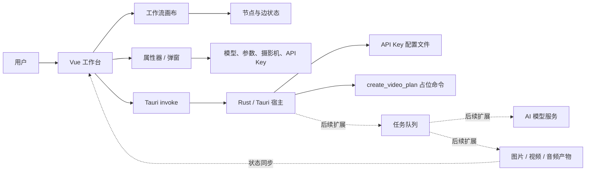

# Linglux 设计文档

Linglux（灵帧AI）是一个桌面优先的 AI 视频创作、编辑、增强与自动化应用。当前代码库是产品原型：前端已经形成可交互的节点式工作流画布，Tauri 后端提供基础命令桥接和 API Key 配置持久化。本文档用于说明当前实现、架构边界和后续演进方向。

## 1. 产品定位

Linglux 的目标是把专业视频生成流程压缩成可视化工作流。用户通过节点串联素材、提示词、摄影机风格、AI 图像生成、视频扩散、音频、分镜和自动化应用，而不是直接面对复杂的模型调用、素材路径和导出任务。

当前原型支持的核心体验：

1. 在画布中查看和组织工作流节点。
2. 添加文本、图片、视频、3D 世界、音频、分镜格子、AI 应用、上传资源和作品导入节点。
3. 拖拽节点、平移画布、查看自动连线和节点状态。
4. 为图片和视频节点选择模型，并估算 token 消耗。
5. 设置提示词、负面提示词、渲染步数、CFG 和运动幅度。
6. 通过摄影机控制面板生成相机、镜头、焦段、光圈和镜头效果提示词。
7. 配置 API Key 和 Base URL，为后续真实 AI 服务调用做准备。

## 2. 当前阶段

当前版本仍是交互原型，不是完整可用的视频生成产品。

已实现：

- Vue 单页桌面工作台 UI。
- 数据驱动的节点定义、节点列表和边列表。
- 节点添加、删除、选择、拖拽和上下文菜单。
- 画布响应式缩放和平移。
- 图片/视频节点的模型选择和 token 估算。
- API Key 设置弹窗，支持 OpenAI、OpenRouter 和自定义 Base URL。
- Tauri 命令持久化 API Key 设置。
- Web 预览模式下的 `localStorage` 兜底。
- 摄影机控制弹窗和提示词合并逻辑。

尚未实现：

- 真实 AI 图像生成、视频扩散和网络请求。
- 项目文件、素材库、缩略图和产物持久化。
- 真正的任务队列、取消、重试、进度和日志。
- 导出编码、导出记录和断点续渲染。
- 账户、计费、团队协作和云端同步。

## 3. 技术栈

| 层级 | 技术 | 当前作用 |
| --- | --- | --- |
| 前端 | Vue 3 + TypeScript | 组织界面、状态和交互逻辑 |
| 样式 | Tailwind CSS 4 | 构建深色桌面工作台、画布和弹窗 |
| 构建 | Vite | 前端开发、预览和打包 |
| 桌面宿主 | Tauri 2 | 桌面窗口、打包、Rust 命令桥接 |
| 后端语言 | Rust | 配置持久化和 Tauri command |
| 图标 | `@lucide/vue` | 导航、按钮、节点和面板图标 |
| 包管理 | npm | 依赖安装和脚本执行 |

## 4. 架构概览



架构边界：

- 前端负责工作流展示、交互状态、参数编辑和轻量估算。
- Tauri 宿主负责桌面能力、配置文件、后续本地文件访问和任务调度。
- 真实模型调用不应直接散落在组件中，应通过稳定的宿主命令或服务适配层发起。
- 当前 `create_video_plan` 只是桥接验证命令，不代表真实视频生成链路。

## 5. 代码结构

```text
.
├── README.md                      # 项目介绍、环境安装、运行与构建说明
├── AGENTS.md                      # 代码协作约定
├── DESIGN.md                      # 本设计文档
├── package.json                   # npm 依赖和脚本
├── package-lock.json              # npm 锁文件
├── vite.config.ts                 # Vite、Vue、Tailwind 和 Tauri 构建配置
├── index.html                     # 前端入口 HTML
├── src/
│   ├── main.ts                    # Vue 应用挂载入口
│   ├── App.vue                    # 当前主工作台、状态和交互原型
│   ├── style.css                  # Tailwind 引入、基础样式和共享工具类
│   └── assets/
│       └── linglux-logo-no-text.png
└── src-tauri/
    ├── tauri.conf.json            # Tauri 窗口、构建、打包和安全配置
    ├── Cargo.toml                 # Rust crate 配置
    ├── capabilities/default.json  # 默认窗口权限
    └── src/
        ├── main.rs                # 桌面进程入口
        └── lib.rs                 # Tauri command 和配置持久化
```

生成目录和本地目录不应提交：

- `node_modules/`
- `dist/`
- `src-tauri/target/`

## 6. 前端工作台设计

当前主界面集中在 `src/App.vue`，采用 Vue Composition API 和 `<script setup lang="ts">`。页面是两栏桌面工作台：

- 左侧栏：品牌、工作区导航、设置入口和宿主状态。
- 主区域：节点画布、悬浮工具箱、节点调色板、节点上下文菜单。
- 浮层：右侧滑出属性器、摄影机控制弹窗、API Key 设置弹窗。

### 6.1 节点类型

节点定义由 `nodeDefinitions` 统一管理。每种节点包含显示名称、标题、角色、描述、图标、尺寸、输入/输出端口偏移和可选模型组。

| 类型 | 作用 | 端口 |
| --- | --- | --- |
| `source` | 上传或引用本地图片资源 | 输出 |
| `text` | 文本提示、对白、旁白或镜头描述 | 输出 |
| `image` | AI 图片生成、增强或重绘 | 输入 + 输出 |
| `video` | 视频扩散和动态镜头生成 | 输入 |
| `world3d` | 3D 场景空间和相机路径约束 | 输出 |
| `audio` | 音乐、音效、旁白或口型参考 | 输出 |
| `storyboard` | 分镜节奏和关键帧顺序 | 输入 + 输出 |
| `aiApp` | 批处理、风格迁移、字幕或增强自动化 | 输入 + 输出 |
| `import` | 从已有作品导入资源 | 输出 |

### 6.2 工作流图状态

当前工作流状态存放在组件内：

| 状态 | 说明 |
| --- | --- |
| `nodes` | 画布节点列表，包含类型、坐标、尺寸、状态、资源名和模型 |
| `workflowEdges` | 节点连接线列表 |
| `selectedNodeId` | 当前选中的节点 |
| `nodeSequence` | 新节点 ID 序号 |
| `dragState` | 节点拖拽状态 |
| `canvasPanState` | 画布平移状态 |
| `canvasScale` | 画布响应式缩放比例 |
| `canvasOffset` | 画布平移偏移 |
| `nodeContextMenu` | 节点右键菜单位置和目标 |

当前默认图包含三类核心节点：

1. `source-1`：本地参考图片。
2. `image-1`：AI 图像生成，默认模型为 `gpt-image-1.5`。
3. `video-1`：AI 视频扩散，默认模型为 `seedance-2.0`。

### 6.3 画布交互

- 节点可拖拽，坐标会被限制在画布范围内。
- 画布可平移，偏移范围根据视口尺寸动态限制。
- 画布在桌面宽度下自动缩放，最小缩放为 `0.58`。
- 连接线由 `workflowEdges` 和节点端口位置计算 SVG 贝塞尔曲线。
- 添加节点时会寻找可用位置，并尝试与当前选中节点自动连接。
- 右键节点可打开上下文菜单并删除节点。
- `Escape` 会关闭浮动菜单。

### 6.4 节点调色板

悬浮工具箱中的“添加节点”按钮会打开节点调色板。调色板分为：

- 添加节点：文本、图片、视频、3D 世界、音频。
- 功能节点：分镜格子、AI 应用。
- 添加资源：上传、从作品导入。

新增节点后会被选中，属性器打开，宿主状态会更新为添加成功。

## 7. 生成参数与模型设计

### 7.1 模型组

当前模型只是前端选项，不会触发真实模型调用。图片和视频节点分别使用不同模型组。

图片模型：

- `gpt-image-1.5`
- `chatgpt-image-latest`
- `gpt-image-1`
- `gpt-image-1-mini`

视频模型：

- `seedance-2.0`
- `seedance-1.5-pro`
- `kling-2.1`
- `kling-2.1-pro`
- `hailuo-02`
- `hailuo-video-01`

每个模型选项包含：

- `id`
- `label`
- `subtitle`
- `baseOutputTokens`

### 7.2 Token 估算

当前 token 估算是界面辅助值，不是供应商计费结果。估算逻辑：

- 中文、全角字符按较高系数估算。
- 非中文字符按约 4 字符 1 token 估算。
- 图片节点叠加提示词、负面提示词、渲染步数和 CFG 控制成本。
- 视频节点叠加提示词、负面提示词、运动控制成本和运动幅度倍率。

后续接入真实服务时，应由模型适配层返回更准确的费用、token、时长或点数估算。

### 7.3 生成按钮行为

图片生成：

1. 检查是否已配置 API Key。
2. 将目标图片节点状态置为 `RENDERING`。
3. 调用 Tauri 的 `create_video_plan` 占位命令。
4. 成功或 Web 预览失败兜底后，将节点状态置为 `READY 100%`。

视频生成：

1. 检查是否已配置 API Key。
2. 将目标视频节点状态置为 `Queued for diffusion`。
3. 使用短延时模拟队列完成。
4. 将节点状态置为 `Ready to render`。

## 8. 摄影机控制设计

摄影机控制是当前原型中较完整的提示词辅助模块。它通过机身、镜头、焦段、光圈和镜头效果组合出摄影风格提示词，再写回主提示词。

### 8.1 相机分类

| 分类 | 示例 |
| --- | --- |
| 胶片机 | ARRI 35-III、ARRIFLEX 435、Bolex H16 |
| 数字机 | ARRI ALEXA Classic、Sony VENICE 2、RED V-RAPTOR 8K VV |
| 照相机 | Nikon F3、Leica M6、Hasselblad 500C/M |
| 手机 | iPhone 15 Pro Max、Xiaomi 14 Ultra、Samsung Galaxy S24 Ultra |

### 8.2 组合参数

- 摄影机预设：默认、电影宽景、人像浅景深、手持纪录。
- 镜头：Zeiss Master Prime、Cooke S4/i、ARRI Signature Prime、Canon K35、Leica Summilux-C。
- 焦段：12mm、18mm、24mm、35mm、50mm、75mm、100mm。
- 光圈：f/1.3、f/1.4、f/2、f/2.8、f/4、f/5.6。
- 镜头效果：散景、眩光、手持。

### 8.3 提示词合并

应用摄影机控制时，前端会生成一行以 `Camera:` 开头的提示词。如果原提示词里已经存在旧的 `Camera:` 行，会先移除再写入新配置，避免重复叠加。

## 9. API Key 与供应商配置

当前支持三个供应商选项：

| 供应商 | 默认 Base URL |
| --- | --- |
| OpenAI | `https://api.openai.com/v1` |
| OpenRouter | `https://openrouter.ai/api/v1` |
| 自定义 | 默认同 OpenAI，可手动修改 |

前端状态：

- `apiKeySettings`：当前已保存配置。
- `apiKeyDraft`：弹窗内编辑中的配置。
- `apiKeyMessage`：配置状态提示。
- `showApiKey`：显示/隐藏输入内容。

Tauri 命令：

```rust
load_api_key_settings(app: AppHandle) -> Result<ApiKeySettings, String>
save_api_key_settings(app: AppHandle, settings: ApiKeySettings) -> Result<ApiKeySettings, String>
clear_api_key_settings(app: AppHandle) -> Result<(), String>
```

桌面模式下，配置会写入 Tauri 应用配置目录中的 `api-key-settings.json`。Web 预览模式无法调用 Tauri 命令时，会退回到 `localStorage`，键名为 `linglux-api-key-settings`。

安全注意：当前 API Key 持久化是原型实现，不应视为最终安全方案。产品化时应迁移到平台安全存储或加密存储，并避免在日志、任务记录或普通项目文件中暴露密钥。

## 10. Tauri 宿主设计

Tauri 配置位于 `src-tauri/tauri.conf.json`。

当前配置：

- 产品名：`Linglux`。
- 标识符：`com.linglux.desktop`。
- 开发地址：`http://127.0.0.1:1420`。
- 前端产物目录：`dist/`。
- 主窗口：`1440x780`，最小尺寸 `960x640`。
- 打包目标：`all`。
- 默认权限：`core:default`。

前端开发脚本使用：

```sh
vite --host 127.0.0.1 --port 1420 --strictPort
```

Rust 当前命令：

| 命令 | 作用 |
| --- | --- |
| `create_video_plan` | 接收提示词并返回占位生产计划，用于验证桥接链路 |
| `load_api_key_settings` | 从应用配置目录读取 API Key 设置 |
| `save_api_key_settings` | 校验并写入 API Key 设置 |
| `clear_api_key_settings` | 删除 API Key 设置文件 |

## 11. 目标数据模型

后续应将当前组件内状态迁移为明确的数据模型。

### Project

| 字段 | 说明 |
| --- | --- |
| `id` | 项目唯一标识 |
| `name` | 项目名称 |
| `createdAt` / `updatedAt` | 创建和更新时间 |
| `workflowId` | 当前主工作流 |
| `assetRoot` | 本地素材目录 |
| `settings` | 项目级默认设置 |

### WorkflowGraph

| 字段 | 说明 |
| --- | --- |
| `id` | 工作流唯一标识 |
| `nodes` | 节点列表 |
| `edges` | 连接线列表 |
| `viewport` | 画布位置、缩放和选择状态 |

### WorkflowNode

| 字段 | 说明 |
| --- | --- |
| `id` | 节点唯一标识 |
| `type` | 节点类型 |
| `position` | 画布坐标 |
| `size` | 节点尺寸 |
| `inputs` / `outputs` | 输入输出端口 |
| `params` | 节点参数 |
| `modelId` | 当前模型 |
| `status` | `idle`、`queued`、`running`、`done`、`failed` |
| `artifactIds` | 节点产物引用 |

### GenerationJob

| 字段 | 说明 |
| --- | --- |
| `id` | 任务唯一标识 |
| `nodeId` | 触发任务的节点 |
| `kind` | 图像生成、视频生成、增强、导出等 |
| `provider` | 模型或服务供应商 |
| `request` | 标准化请求参数 |
| `progress` | 进度百分比 |
| `logs` | 任务日志 |
| `resultArtifactIds` | 输出产物 |

### Artifact

| 字段 | 说明 |
| --- | --- |
| `id` | 产物唯一标识 |
| `kind` | 图片、视频、音频、字幕、项目快照等 |
| `uri` | 本地路径或远程地址 |
| `metadata` | 宽高、时长、编码、文件大小等 |
| `sourceJobId` | 生成它的任务 |

## 12. 推荐业务流程

### 图像生成

1. 用户配置 API Key、模型和提示词。
2. 用户在图片节点点击生成。
3. 前端创建标准化任务请求。
4. Tauri 宿主写入任务队列。
5. 模型适配层调用本地模型、远程 API 或代理服务。
6. 结果保存为 `Artifact`。
7. 前端订阅任务状态并刷新节点预览。

### 视频扩散

1. 用户选择图像产物和视频模型。
2. 用户设置运动幅度、时长和分辨率。
3. 视频节点创建 `video-diffusion` 任务。
4. 队列系统负责排队、取消、重试和错误恢复。
5. 完成后生成视频产物，节点进入 `done` 状态。

### 导出

1. 用户选择目标格式、分辨率、码率和保存位置。
2. 宿主执行本地导出任务。
3. 前端展示进度、日志和错误。
4. 导出完成后写入导出记录。

## 13. 安全与权限

当前 Tauri capability 只声明默认窗口和 `core:default` 权限。后续新增文件系统、Shell、网络或系统级能力时，应遵守：

- 按功能最小化授权。
- 文件读写限定在用户选择的项目目录、缓存目录或导出目录。
- API Key 使用安全存储，不写入普通项目文件。
- 远程模型调用通过宿主或后端代理统一处理。
- 任务日志、错误日志和调试输出必须脱敏。
- Web 预览的 `localStorage` 兜底只用于开发，不作为生产密钥存储。

## 14. 模块拆分方向

当前 `App.vue` 承载了大部分原型逻辑。进入功能开发后建议拆分。

前端模块：

| 模块 | 职责 |
| --- | --- |
| `components/sidebar` | 工作区导航、设置入口、宿主状态 |
| `components/workflow` | 画布、节点、连线、拖拽、调色板 |
| `components/inspector` | 节点属性器、模型选择、参数编辑 |
| `components/camera` | 摄影机资料、镜头预设、提示词合并 |
| `components/settings` | API Key 和供应商设置 |
| `stores/workflow` | 节点、边、选择、视口状态 |
| `stores/settings` | API Key、供应商、默认模型 |
| `services/tauri` | Tauri invoke 封装和 Web 预览兜底 |

Rust 模块：

| 模块 | 职责 |
| --- | --- |
| `commands` | Tauri command 入口 |
| `settings` | API Key、供应商和应用配置 |
| `storage` | 项目文件、素材和产物路径 |
| `jobs` | 任务队列、状态、取消和重试 |
| `providers` | 模型供应商适配 |
| `export` | 本地导出和编码参数 |

## 15. 构建与运行

安装依赖：

```sh
npm install
```

开发 Web UI：

```sh
npm run dev
```

开发桌面应用：

```sh
npm run tauri:dev
```

构建前端：

```sh
npm run build
```

构建桌面应用：

```sh
npm run tauri:build
```

Tauri 开发模式会根据 `src-tauri/tauri.conf.json` 自动启动 Vite 服务，不需要先单独运行 `npm run dev`。

## 16. 测试策略

当前项目尚未配置专门测试框架。建议采用分层验证：

- 文档变更：不需要构建，除非更新了命令、配置或可执行示例。
- 前端/TypeScript 变更：运行 `npm run build`。
- Tauri/Rust 变更：运行 `cargo check --manifest-path src-tauri/Cargo.toml`。
- 桥接变更：同时验证前端构建和 Rust 检查。
- 交互变更：后续补充浏览器自动化，覆盖添加节点、拖拽、删除、API Key 设置和摄影机应用。

## 17. 演进路线

### 阶段 1：原型结构化

- 将 `App.vue` 拆成工作流、设置、摄影机和属性器组件。
- 将节点定义、模型定义和摄影机资料移到独立模块。
- 将工作流图状态从组件内迁移到专门 store。
- 为节点添加、删除、连线和 token 估算补充单元测试。

### 阶段 2：项目与素材

- 增加项目创建、打开、保存和最近项目。
- 支持素材导入、缩略图、元数据读取和引用管理。
- 将工作流图保存为项目文件。

### 阶段 3：任务系统

- 引入生成任务队列。
- 实现任务创建、取消、重试、日志和进度同步。
- 将图片/视频生成从模拟状态改为真实任务状态。

### 阶段 4：模型服务

- 实现供应商适配层。
- 接入至少一个图片生成服务和一个视频生成服务。
- 增加费用估算、错误标准化和服务健康检查。

### 阶段 5：导出与桌面产品化

- 实现导出节点、导出记录和失败重试。
- 收紧 Tauri 权限和密钥存储策略。
- 增加平台差异处理、错误诊断、更新机制、打包签名和发布流程。

## 18. 设计原则

- 前端表达创作意图，宿主执行桌面能力。
- 节点是业务单元，任务是运行单元，产物是可复用结果。
- 长任务必须有进度、取消、重试和错误恢复。
- 密钥和素材路径默认敏感，日志必须克制。
- 原型可以集中实现，产品化必须拆清边界。
- 先把本地项目体验做扎实，再扩展云端协作。
