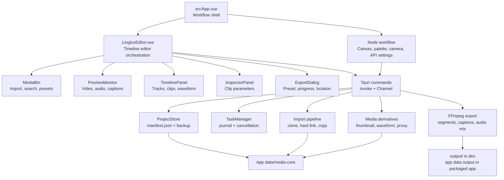

# Linglux Design

Linglux 是一个 desktop-first 的 AI 视频创作与剪辑工作台。它把「节点式 AI 工作流」和「传统时间线剪辑器」放在同一个桌面应用里：前者负责生成、增强和自动化，后者负责把素材落到时间线中做可控编辑、预览、保存与导出。

本文档描述当前源码实际状态和下一阶段设计方向。源码可能比早期产品设想更靠前；修改功能前以源码为准，并在文档中补齐差异。

## Product North Star

Linglux 面向希望在本地桌面环境中完成专业视频创作的用户：

- 用节点组织 AI 任务、参数、上下游资产和复用结果。
- 用时间线完成视频、音频、字幕、图片和生成素材的精细编辑。
- 用 Tauri/Rust 承接本地文件、长任务、缓存、导出和桌面能力。
- 让前端保持即时、清晰、创作导向，把重型媒体处理留给宿主端。

设计上的核心约束是：**创作意图在前端表达，媒体事实在本地宿主保存，长任务必须可观察、可取消、可恢复。**

## Current Snapshot

当前应用已经具备两套主要工作区：

- 工作流工作区：位于 `src/App.vue`，包含深色节点画布、节点面板、模型/API Key 设置、镜头语言控制、生成模拟、工件列表和工作区切换。
- 剪辑器工作区：位于 `src/components/editor/`，包含媒体库、预览监视器、时间线、检查器、导出弹窗、撤销/重做、媒体导入、桌面保存和 FFmpeg 导出。

相比早期原型，剪辑器已经接入了一个真实的本地媒体内核：

- Rust crate `src-tauri/crates/linglux-media-core` 负责项目清单、托管媒体、缓存、任务队列、任务日志、导入、派生资源和 FFmpeg 进程执行。
- Tauri 命令通过 Channel 推送长任务事件，前端不再把大媒体字节塞进 JSON IPC。
- 桌面导入会把用户选择的文件复制或克隆到 app data 下的项目目录，并生成 `file://`/asset protocol 可访问地址。
- 视频、图片和音频派生资源包括缩略图、波形峰值和按需生成的视频代理文件。
- 导出已经从纯模拟推进到 FFmpeg 流程，能够输出文件和旁路 manifest，并把完成结果回写到工作流。

仍属于原型阶段的能力：

- 工作流侧的 AI provider 调用仍主要是模拟或 host bridge smoke test。
- 真实项目打开/最近项目列表、素材缺失恢复、跨项目资产复用和完整文件浏览还未产品化。
- 生产级密钥存储、provider 成本统计、失败重试策略和任务日志 UI 还未完成。
- FFmpeg 依赖当前通过本机 PATH 或常见安装目录发现，尚未作为 bundle sidecar 完整交付。

## Technology Stack

Frontend:

- Vue 3 + TypeScript + Vite。
- Vue Composition API，主要组件使用 `<script setup lang="ts">`。
- Nuxt UI Vue/Vite 插件提供基础 UI 组件和主题变量。
- `@lucide/vue` 用于常见动作图标。
- Tailwind CSS v4 通过 Nuxt UI/Tailwind 栈参与样式构建。
- npm 和 `package-lock.json` 是当前包管理约定。

Desktop host:

- Tauri 2。
- Rust edition 2021，主 crate 最低 Rust 版本声明为 `1.77.2`。
- `tauri-plugin-dialog` 用于原生打开文件对话框。
- `protocol-asset` 用于安全访问 app data 下的托管媒体。
- `linglux-media-core` workspace crate 承接媒体核心能力。

External runtime:

- Node.js 20+ 用于前端开发和构建。
- Rust toolchain 用于 Tauri 和 media-core。
- FFmpeg/FFprobe 用于派生资源和导出。

## Repository Map

关键文件和目录：

- `README.md`: 项目启动、开发、构建、故障排查和平台要求。
- `DESIGN.md`: 当前产品和架构设计文档。
- `AGENTS.md`: 给代码代理的仓库操作指南。
- `MEDIA_CORE.md`: 媒体内核设计、目录布局、任务模型和验证方法。
- `package.json`: npm scripts 与前端/Tauri 依赖。
- `vite.config.ts`: Vite、Vue、Nuxt UI 插件与 dev server 配置。
- `src/main.ts`: Vue app 入口，注册 Nuxt UI 插件。
- `src/App.vue`: 应用外壳和工作流工作区。
- `src/style.css`: 全局样式、Tailwind import、画布/编辑器工具样式。
- `src/types/editor.ts`: 剪辑器前端数据契约。
- `src/lib/editorProject.ts`: 项目默认值、session helper、clip factory、时间线工具和归一化逻辑。
- `src/components/editor/LingluxEditor.vue`: 剪辑器编排层。
- `src/components/editor/MediaBin.vue`: 媒体库、导入、筛选、多选、拖拽和预设素材。
- `src/components/editor/PreviewMonitor.vue`: 预览监视器、视频时钟、音频同步和字幕叠加。
- `src/components/editor/TimelinePanel.vue`: 时间线、轨道、虚拟化、拖拽、吸附、磁性主轨和波形显示。
- `src/components/editor/AudioWaveform.vue`: Canvas 波形渲染。
- `src/components/editor/InspectorPanel.vue`: 选中 clip 参数编辑。
- `src/components/editor/ExportDialog.vue`: 导出预设、进度、取消和打开位置。
- `src-tauri/src/lib.rs`: Tauri 命令、API key 设置、media-core 桥接、保存、导入、派生资源和导出。
- `src-tauri/tauri.conf.json`: Tauri dev/build URL、窗口、安全和 bundle 配置。
- `src-tauri/capabilities/default.json`: 当前 Tauri 权限。
- `src-tauri/crates/linglux-media-core/`: 媒体核心 Rust crate。
- `output/`: 开发环境导出产物目录，属于本地生成结果而不是源代码。

## High-Level Architecture


```mermaid
flowchart TD
  App["src/App.vue\nWorkflow shell"] --> Workflow["Node workflow\nCanvas, palette, camera, API settings"]
  App --> Editor["LingluxEditor.vue\nTimeline editor orchestration"]

  Editor --> Bin["MediaBin\nImport, search, presets"]
  Editor --> Preview["PreviewMonitor\nVideo, audio, captions"]
  Editor --> Timeline["TimelinePanel\nTracks, clips, waveform"]
  Editor --> Inspector["InspectorPanel\nClip parameters"]
  Editor --> ExportDialog["ExportDialog\nPreset, progress, location"]

  Editor --> Tauri["Tauri commands\ninvoke + Channel<TaskEvent>"]
  Workflow --> Tauri

  Tauri --> Store["ProjectStore\nmanifest.json + backup"]
  Tauri --> Tasks["TaskManager\njournal + cancellation"]
  Tauri --> Import["Import pipeline\nclone, hard link, copy"]
  Tauri --> Derivatives["Media derivatives\nthumbnail, waveform, proxy"]
  Tauri --> Export["FFmpeg export\nsegments, captions, audio mix"]

  Store --> AppData["App data/media-core"]
  Import --> AppData
  Derivatives --> AppData
  Export --> DevOutput["output/ in dev\napp data output in packaged app"]
```

The architectural boundary is intentionally simple:

- Vue owns interactive state, visual editing decisions, optimistic UI, keyboard shortcuts and browser fallback behavior.
- Tauri owns desktop APIs, local paths, app data directories, long-running work and command registration.
- `linglux-media-core` owns durable media facts: project manifests, managed files, cache, task state, import and derivative generation.
- FFmpeg owns real media transforms, but all process execution is wrapped by Rust task handles so progress and cancellation can be surfaced.

## Workflow Workspace

The workflow workspace is the entry surface for generation and automation.

Current responsibilities:

- Render a node canvas with pan, drag, selection, context menu and dynamic wires.
- Maintain workflow nodes and edges in local Vue state.
- Define node categories through `NodeType`, `CanvasNode`, `nodeDefinitions`, `nodePaletteSections` and model option maps.
- Expose generation controls for image/video tasks.
- Build camera prompt cues from camera body, lens, focal length, aperture and lens effect settings.
- Persist API key settings through Tauri commands on desktop and localStorage fallback on web preview.
- Open the editor workspace with an edit session seeded from a source node.
- Receive editor export results and turn them back into workflow artifacts.

Important interaction rules:

- Workflow nodes should remain data-driven; add new node types by extending definitions rather than duplicating markup.
- Canvas interaction changes must preserve pointer cleanup, Escape behavior, bounds clamping, selected-node behavior and responsive sizing.
- Camera prompt application preserves the `Camera:` prefix replacement behavior so repeated application does not stack duplicate camera lines.
- The current model lists and token estimates are UI/product scaffolding, not stable backend contracts.

Target direction:

- Nodes should become business units: provider configuration, prompt assembly, media transforms, validation and artifact reuse.
- Jobs should become runtime units: queued, cancellable, retryable, observable and cost-aware.
- Artifacts should become durable reusable results, not just in-memory demo outputs.

## Editor Workspace

`LingluxEditor.vue` is the editor orchestration layer. It clones the incoming session project and owns:

- Current editable project.
- Selection state for clips and assets.
- Multi-select asset state and media library preview state.
- Playback/playhead/scrubbing state.
- Timeline zoom, snapping and magnetic main track state.
- Shortcut bindings.
- Dirty/save state.
- Import, derivative and export task status.
- Object URL lifecycle for web fallback imports.
- Project history and future stacks for undo/redo.

Child components remain focused:

- `MediaBin.vue` handles media import UI, tabs/search, preset assets, native dialog bridge, multi-select, marquee selection and media drag start.
- `PreviewMonitor.vue` handles active visual preview, native video clock handoff, audio element sync, subtitle overlays and fallback states.
- `TimelinePanel.vue` handles track rendering, clip rendering, virtualized rulers/clips, drag/drop, trim/split/delete, zoom, snapping, magnet controls and waveform/beat display.
- `InspectorPanel.vue` edits selected clip transform, audio/effect settings and text style.
- `ExportDialog.vue` manages export preset selection, progress, cancellation, reveal and completion.
- `AudioWaveform.vue` renders waveform peaks in a stable canvas surface.

### Editor Data Shape

The editor frontend data contract lives in `src/types/editor.ts`.

Key concepts:

- `EditorSession`: session wrapper used when entering the editor.
- `EditorProject`: durable project object with assets, tracks, duration, resolution, main track magnet preference and update time.
- `MediaAsset`: project asset with type, URL, optional managed file path, proxy path, fingerprint, thumbnail, waveform peaks, duration and dimensions.
- `TimelineTrack`: video, overlay, audio or caption track with visibility/media enable flags.
- `TimelineClip`: time-ranged asset or text clip with transform, opacity, volume/mute, effects, text style, beat markers and visibility.
- `TextClipStyle`: font, size, color, line metrics and optional background box settings for caption/text clips.
- `MediaTaskSnapshot` and `MediaTaskEvent`: long-task state shared between Tauri and Vue.

`src/lib/editorProject.ts` provides:

- Export presets.
- Timeline constants and zoom limits.
- Default text style.
- Seeded demo edit sessions.
- Clip factories.
- Project cloning and normalization.
- Duration/timecode formatting.
- Primary-track gap closing when magnet mode is enabled.

Data normalization is important because Rust manifests, previous frontend state and web fallback objects may not always include newer fields. New fields should be introduced with explicit defaults in both TypeScript helpers and Rust serde models.

### History Model

The editor uses scoped project history entries rather than blind whole-app snapshots for every small interaction.

Design intent:

- Capture state before project mutations.
- Mark the project dirty after meaningful changes.
- Coalesce continuous edits where appropriate.
- Keep memory bounded.
- Preserve undo/redo for timeline, asset, track and project-level operations.

New editing operations should integrate with the existing history helpers instead of introducing isolated rollback state.

### Media Import

There are two import paths.

Desktop path:

1. User chooses files through `@tauri-apps/plugin-dialog` or drops files onto the Tauri webview.
2. Frontend calls `start_import_media` with file paths and receives task events through a `Channel<TaskEvent>`.
3. Rust imports supported media into the project media directory.
4. Frontend creates managed `MediaAsset` records using managed path, fingerprint and `convertFileSrc`.
5. Frontend requests derivatives through `start_media_derivatives`.
6. Assets receive thumbnails, waveform peaks and eventually video proxy paths.

Web preview fallback:

1. User imports browser `File` objects.
2. Frontend creates object URLs.
3. Metadata, thumbnails and waveforms are generated defensively in the browser.
4. Object URLs are revoked through the existing cleanup path.

Supported import classes include common video, image, audio and caption/text extensions. Actual validation happens in Rust for desktop imports and in browser helpers for web preview.

Design rules:

- Do not pass large media bytes over Tauri JSON IPC.
- Preserve web fallback for UI development and browser preview.
- Keep object URL cleanup reliable.
- Derivative generation should tolerate missing FFmpeg and return warnings/errors through task state, not crash the editor.
- Managed paths and proxy paths are desktop facts; UI should use `convertFileSrc` for display.

### Timeline

The timeline is the main precision surface.

Current behaviors:

- Tracks support video, overlay, audio and caption media kinds.
- Empty timelines show a compact primary track by default.
- Displayed tracks are filtered to active/compatible tracks unless content or dragging state requires more context.
- Clips and ruler ticks are virtualized horizontally for performance.
- Timeline has zoom controls, wheel/scroll interaction and stable pixel-per-second constraints.
- Clip placement respects track/media compatibility.
- Primary video track can operate in magnetic mode: clips are kept contiguous by closing gaps.
- First visual asset on an empty timeline anchors to the primary video track.
- Audio clips can display waveforms and generated beat markers.
- Split logic preserves source offsets and splits beat markers for audio.

Design rules:

- Do not break drag cleanup, playhead scrub cleanup or global pointer listeners.
- Keep fixed-format timeline controls dimensionally stable.
- Preserve snapping and magnetic primary-track behavior when adding insert/move operations.
- Keep waveform rendering bounded and performant.
- Track-level visibility and audio enablement should affect preview/export consistently.

### Preview

The preview monitor represents timeline playback, not just a thumbnail.

Current behaviors:

- Uses a 16:9 responsive preview frame.
- Chooses active visual content from overlay/video tracks or from media-library preview.
- Delegates timing to the native video element when a video clip is active.
- Synchronizes playhead updates while avoiding excessive event churn.
- Manages audio elements for active timeline audio clips.
- Corrects audio drift during playback and handles scrubbing.
- Renders caption/text overlays with the clip text style.
- Provides fallback states for missing, unsupported or failed preview sources.

Design rules:

- Preserve native video clock handoff.
- Keep audio and video state cleanup on unmount.
- Avoid UI changes that occlude preview content or make scrub feedback ambiguous.
- When proxy media exists, preview should prefer the proxy where appropriate.

### Inspector

The inspector edits selected clip properties.

Current editable surfaces:

- Position, scale, rotation and opacity.
- Volume and mute for audio/video clips with audio.
- Effect intensity.
- Text content and typography for caption/text clips.
- Text background box size, offset, color and corner radius.

Design rules:

- Inspector edits should use typed patch events and participate in history.
- Text-style defaults must be compatible with both frontend rendering and Rust export serialization.
- Do not add inspector-only fields without adding defaults and serialization behavior.

### Export

Export is now a task-backed desktop flow with web fallback.

Desktop flow:

1. User chooses an export preset in `ExportDialog.vue`.
2. Frontend calls `start_export` with the current project and preset.
3. Rust creates a media task and runs FFmpeg work under task control.
4. Exported media is written to `output/` during development or app data output in packaged builds.
5. A manifest JSON is written beside the output.
6. Frontend receives the `EditorExportResult`, can reveal the file location and can send the artifact back to the workflow.

The FFmpeg export path currently supports:

- Visual segment rendering from video/image clips.
- Caption/text burn-in using FFmpeg drawtext-style filters.
- Audio mixing for audio-capable clips.
- MP4/MOV H.264 + AAC output and WebM VP9 + Opus output.
- Warnings for skipped or missing audio cases.
- Cancellation through task handles.

Design rules:

- Export should reject empty/non-exportable timelines clearly.
- Reveal/open-location must stay scoped to known output locations.
- Export progress, task state, output path, manifest path and warnings must remain visible to the UI.
- Web preview fallback can simulate export, but desktop behavior should prefer the real task-backed path.

## Media Core

The media core is documented in more detail in `MEDIA_CORE.md`. This section summarizes the product architecture contract.

The root directory is under Tauri app data:

```text
media-core/
  projects/
    <project-id>.linglux/
      manifest.json
      manifest.json.bak
      media/
      proxies/
  cache/
    thumbnails/
    waveforms/
  tasks/
```

Core modules:

- `project_store.rs`: project directories, manifest save/load, backup fallback and revision increments.
- `task.rs`: task snapshots, states, journal persistence and cancellation.
- `executor.rs`: separate export and media queues.
- `import.rs`: supported file validation, same-volume clone/hard-link optimization and buffered copy fallback.
- `media.rs`: metadata probing, thumbnail, waveform and proxy generation.
- `ffmpeg.rs`: FFmpeg/FFprobe discovery and process execution with progress parsing.
- `cache.rs`: derivative cache pathing, stats, namespace clearing and pruning.

Task model:

- Normal states: `queued`, `running`, `succeeded`, `failed`.
- Cancellation states: `cancelling`, `cancelled`.
- Recovery state: unfinished journal entries restore as `interrupted`.

Queue model:

- Exports use one worker.
- Import and derivative jobs share media workers.
- Long work should publish events rather than blocking the frontend.

Persistence model:

- Project save writes `manifest.json.next`, syncs it, rotates the previous manifest to `manifest.json.bak`, then replaces active manifest.
- Project load can fall back to backup if the active manifest is unreadable.
- Revisions increment on save.
- Large media files live in `media/`; generated video proxies live in `proxies/`; derivative cache lives under `cache/`.

Cache model:

- Thumbnails and waveform JSON are keyed by content fingerprint.
- Proxy files are project-local.
- Cache pruning currently targets a bounded size.

## Tauri Boundary

Frontend-callable commands are registered in `src-tauri/src/lib.rs`.

Current command surface:

- `create_video_plan`
- `load_api_key_settings`
- `save_api_key_settings`
- `clear_api_key_settings`
- `create_edit_session`
- `load_edit_project`
- `save_edit_project`
- `start_import_media`
- `start_media_derivatives`
- `start_export`
- `cancel_media_task`
- `get_media_task`
- `list_media_tasks`
- `reveal_export_file`

Design rules:

- Command payloads must stay compatible with `src/types/editor.ts`.
- New Rust serde fields should be optional or have defaults unless old projects are migrated.
- New frontend-required fields should be mirrored in Rust deliberately.
- Long commands should use task snapshots/events and cancellation where possible.
- Do not use raw OS paths directly in UI media elements; convert managed paths with Tauri asset helpers.
- Keep web fallback behavior for frontend-only development unless a feature is explicitly desktop-only.

## Security And Permissions

Current Tauri security posture:

- `src-tauri/capabilities/default.json` grants `core:default` and `dialog:allow-open`.
- Asset protocol is enabled only for `$APPDATA/**`.
- Desktop API key settings are persisted under the Tauri app config directory as `api-key-settings.json`.
- Web preview uses `localStorage` key `linglux-api-key-settings`.
- Export reveal is guarded so arbitrary paths are not opened.

Security rules:

- Never log full API keys.
- Never include API keys in project manifests, task logs, artifacts, export manifests or error strings.
- Mask keys in UI summaries.
- Do not broaden Tauri permissions unless a user-visible feature requires it.
- Scope file system, shell, network and secret-storage access narrowly.
- Treat prototype JSON/localStorage key storage as non-final; production needs OS-backed secret storage or equivalent.

## Styling And Interaction Direction

Linglux should feel like a dense professional desktop workstation:

- Dark restrained UI.
- Compact controls.
- Clear hierarchy.
- Canvas/grid surfaces.
- Teal/green and blue accents.
- Stable panel dimensions.
- No marketing-style landing sections inside the app surface.

Frontend conventions:

- Use Vue Composition API and TypeScript types.
- Prefer existing Nuxt UI components for dialogs, popovers, buttons and form controls.
- Use lucide icons for common tool actions.
- Preserve semantic labels, useful `aria-label`s and button `type="button"`.
- Avoid broad palette rewrites unless the product direction explicitly changes.
- Keep text from overflowing buttons, tabs, cards and timeline controls.

## Data And Migration Principles

Project and media data will evolve. Current principles:

- `EditorProject` is the frontend source of editing truth.
- Media-core manifest is the durable desktop representation.
- Rust and TypeScript models currently mirror many fields; keep them synchronized.
- New fields need defaults in `normalizeEditorProject` and Rust serde defaults.
- Old projects should load with sensible fallbacks.
- Manifests should prefer explicit schema versions and revisions.
- Task records should be useful for recovery and debugging without leaking secrets or large payloads.

## Known Gaps

Product gaps:

- Real AI model/provider integration is not implemented end-to-end.
- Node outputs are not yet durable project assets in a fully general way.
- Project browser, recent files and missing media recovery are not complete.
- Export queue UI and historical task log UI are minimal.
- Provider cost/progress accounting is not implemented.
- Production secret storage is not implemented.

Technical gaps:

- FFmpeg is currently discovered from the system rather than guaranteed through bundled sidecars.
- Rust and TypeScript models are duplicated manually.
- Export filter graph coverage is still narrow compared with a professional NLE.
- Timeline performance needs continued validation with large projects.
- Audio waveform and beat detection are lightweight approximations.
- Cache cleanup and task journal retention need product policy.
- Generated development output under `output/` should not be treated as source.

## Roadmap

Near-term architecture work:

1. Harden media-core integration for save/load/import/export edge cases.
2. Add project browser and recent project flow.
3. Improve task log UI with retry, cancellation and recoverable errors.
4. Bundle or configure FFmpeg sidecars for packaged desktop builds.
5. Normalize provider request/response contracts for real AI jobs.
6. Store API secrets in a production-grade secret backend.
7. Expand export coverage for transforms, opacity, track enablement and text styling.
8. Add focused tests around project normalization, timeline edits and Tauri bridge payloads.

Medium-term product work:

1. Promote generated workflow artifacts into managed project assets.
2. Add reusable node/job/artifact library.
3. Support durable asset relinking and project portability.
4. Add provider cost estimation and job observability.
5. Add richer timeline editing: transitions, keyframes, nested sequences and proxy policy controls.
6. Add collaboration/export manifest formats only after local project semantics are stable.

## Validation

Use the narrowest reliable validation for touched areas:

```sh
npm run build
```

Frontend and shared TypeScript validation.

```sh
cargo check --manifest-path src-tauri/Cargo.toml
```

Tauri command, Rust bridge and host validation.

```sh
cargo test --manifest-path src-tauri/Cargo.toml -p linglux-media-core
```

Media-core unit tests.

```sh
npm run tauri:build
```

Packaging, window, bundle, permission and full desktop build validation.

FFmpeg-related changes should also be exercised on a machine where `ffmpeg` and `ffprobe` are discoverable.

Documentation-only edits do not require a build unless commands, configuration assumptions or executable examples changed.

## Design Principles

- Keep the editor usable as a desktop workstation first.
- Keep media files local, durable and recoverable.
- Keep long work visible, cancellable and resumable.
- Keep frontend state immediate and expressive.
- Keep Tauri commands small and typed.
- Keep permissions narrow.
- Keep provider integrations explicit rather than hidden in UI components.
- Prefer real source state over stale docs, then update docs to match.
